# 🚀 웹 프론트엔드 프로젝트에 CD/CD 적용하기

> 현업 프로젝트 배포 과정을 실습하며 정리한 기록

<br>

## 1️⃣ 프로젝트 초기 세팅

### 프로젝트 생성 & Git 연결

```bash
$ npm create vite@latest cicd-sandbox -- --template react

$ git init
$ git remote add origin <해당-repo-url>

```

<br>

## 2️⃣ Git Branch 전략

```bash
$ git checkout -b dev
$ git push -u origin dev
```

- `main`: 안정적인 배포용 브랜치
- `dev`: 개발용 브랜치

<br>

## 3️⃣ Issue 관리

작업 단위를 최대한 작게 나누어 충돌을 줄인다.  
충돌을 방지하기 위해 가능한 한 독립적인 컴포넌트나 기능 단위로 작업을 나누는 것이 좋다.

만약 프로젝트 기간이 3주라면,

- 1~2주차: 기능 개발
- 3일: 기능 마무리 + 배포 준비
- 3~4일: 배포 및 안정화

<br>

## 4️⃣ S3 버킷 생성 및 설정

- 배포 환경 (실제 사용자용): prod-cicd-sandbox
- 개발 환경 (테스트용): dev-cicd-sandbox

설정 방법:

1. 권한 > 버킷 정책
2. 속성 > 정적 웹 사이트 호스팅 > 활성화

<br>

## 5️⃣ CloudFront + 도메인 연결

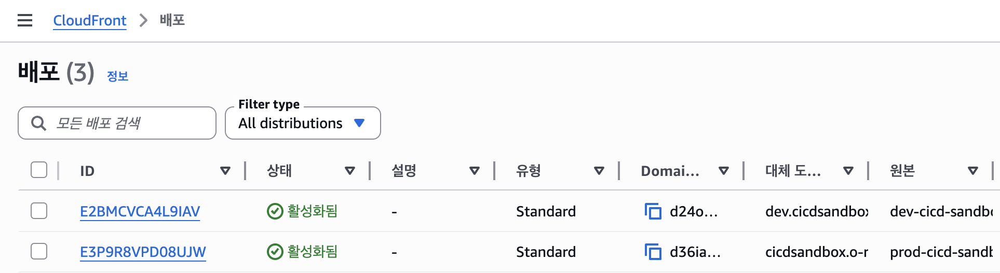

- 프로덕션 / 개발용 각각 따로 CloudFront 배포 생성

<br>

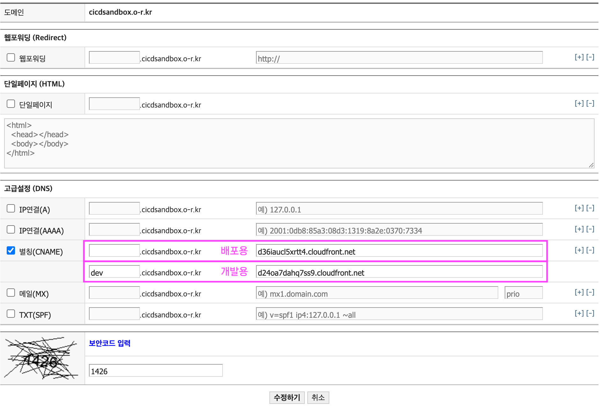

- 도메인 연결 시에도 prod, dev 따로 매핑

실습 :

- [S3-prod](http://prod-cicd-sandbox.s3-website.ap-northeast-2.amazonaws.com/)
- [S3-dev](http://dev-cicd-sandbox.s3-website.ap-northeast-2.amazonaws.com/)
- [CloudFront-prod](https://d36iaucl5xrtt4.cloudfront.net/)
- [CloudFront-dev](https://d24oa7dahq7ss9.cloudfront.net/)

<br>

## 6️⃣ ACM 인증서 발급 & 적용

### (1) 인증서 발급

#### CloudFront > 설정 > 편집 > ACM 발급 요청

🚀 배포 환경

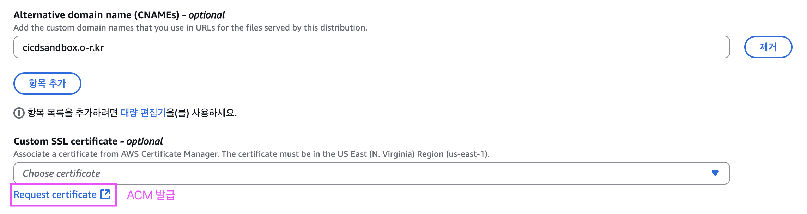

👩🏻‍💻 개발 환경

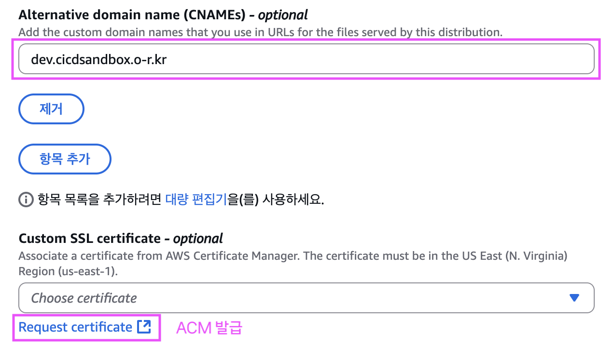

<br>

### (2) 도메인에 CNAME 추가

#### 발급 후, ACM에서 제공하는 CNAME 레코드를 도메인에 등록한다.

🚀 배포 환경

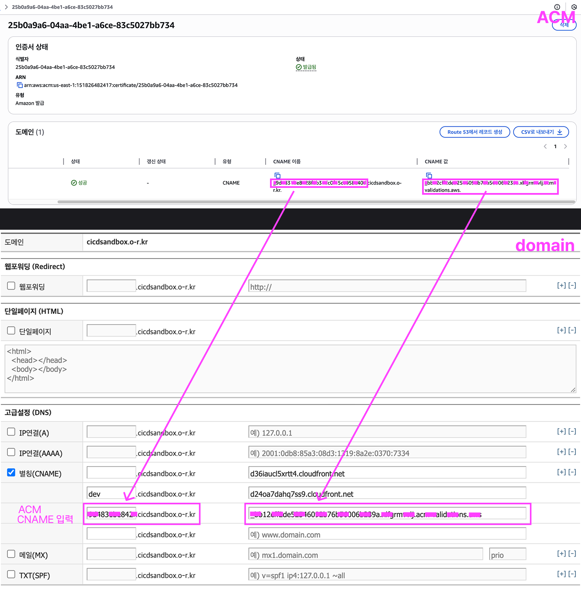

👩🏻‍💻 개발 환경

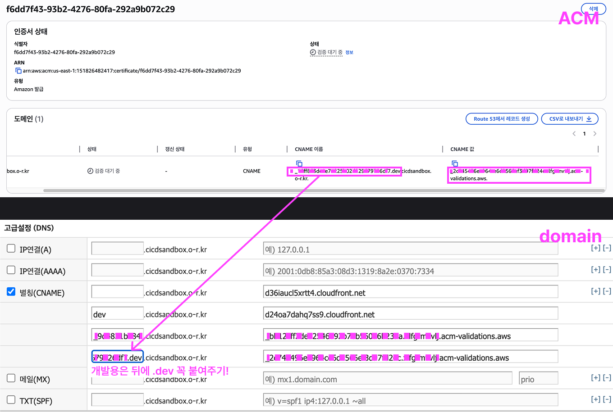

<br>

### (3) CloudFront에 인증서 적용

#### CloudFront 콘솔에서 `설정 > 편집 > 인증서 적용` 진행

🚀 배포 환경

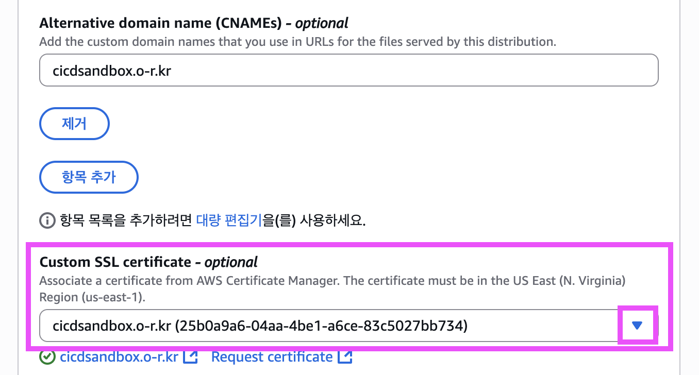

👩🏻‍💻 개발 환경


<br>

### (4) 결과 확인

- [배포 환경: cicdsandbox.o-r.kr](https://cicdsandbox.o-r.kr/)
- [개발 환경: dev.cicdsandbox.o-r.kr](https://dev.cicdsandbox.o-r.kr/)

<br>

## 7️⃣ CI/CD

배포/개발 환경별 워크플로우를 나눈다.

### 📄 deploy-dev.yml

```yml
name: Deploy To Dev S3

on:
  push:
    branches:
      - dev

jobs:
  deploy:
    runs-on: ubuntu-latest
    steps:
      - name: Github Repository 파일 불러오기
        uses: actions/checkout@v4

      - name: 의존성 설치
        run: npm install

      - name: 빌드
        run: npm run build

      - name: AWS 인증 절차
        uses: aws-actions/configure-aws-credentials@v4
        with:
          aws-region: ap-northeast-2
          aws-access-key-id: ${{ secrets.AWS_ACCESS_KEY_ID }}
          aws-secret-access-key: ${{secrets.AWS_SECRET_ACCESS_KEY}}

      - name: S3 기존 파일들 삭제 후 새로 업로드
        run: |
          aws s3 rm --recursive s3://dev-cicd-sandbox
          aws s3 cp ./dist s3://dev-cicd-sandbox/ --recursive

      - name: CloudFront 캐시 무효화
        run: aws cloudfront create-invalidation --distribution-id E2BMCVCA4L9IAV --paths "/*"
```

<br>

### 📄 deploy-prod.yml

```yml
name: Deploy To Prod S3

on:
  push:
    branches:
      - main

jobs:
  deploy:
    runs-on: ubuntu-latest
    steps:
      - name: Github Repository 파일 불러오기
        uses: actions/checkout@v4

      - name: 의존성 설치
        run: npm install

      - name: 빌드
        run: npm run build

      - name: AWS 인증 절차
        uses: aws-actions/configure-aws-credentials@v4
        with:
          aws-region: ap-northeast-2
          aws-access-key-id: ${{ secrets.AWS_ACCESS_KEY_ID }}
          aws-secret-access-key: ${{secrets.AWS_SECRET_ACCESS_KEY}}

      - name: S3 기존 파일들 삭제 후 새로 업로드
        run: |
          aws s3 rm --recursive s3://prod-cicd-sandbox
          aws s3 cp ./dist s3://prod-cicd-sandbox/ --recursive

      - name: CloudFront 캐시 무효화
        run: aws cloudfront create-invalidation --distribution-id E3P9R8VPD08UJW --paths "/*"
```

<br>

## 8️⃣ IAM & GitHub Secrets 설정

### IAM 사용자 생성

#### 배포 환경 & 개발 환경 공통 사용자 생성

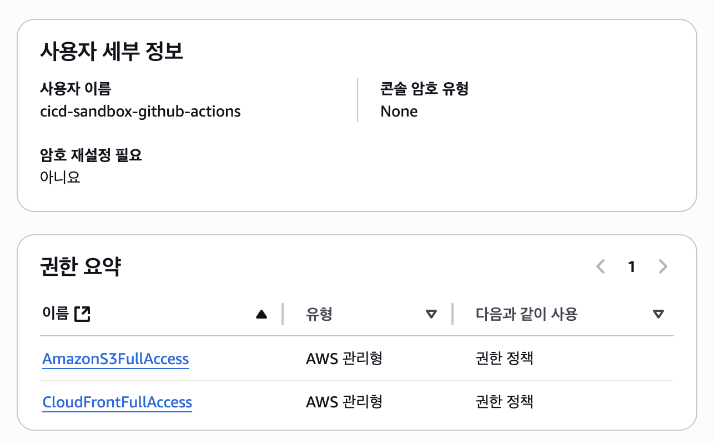

<br>

### 액세스 키 발급

#### IAM > 사용자 > 보안 자격 증명

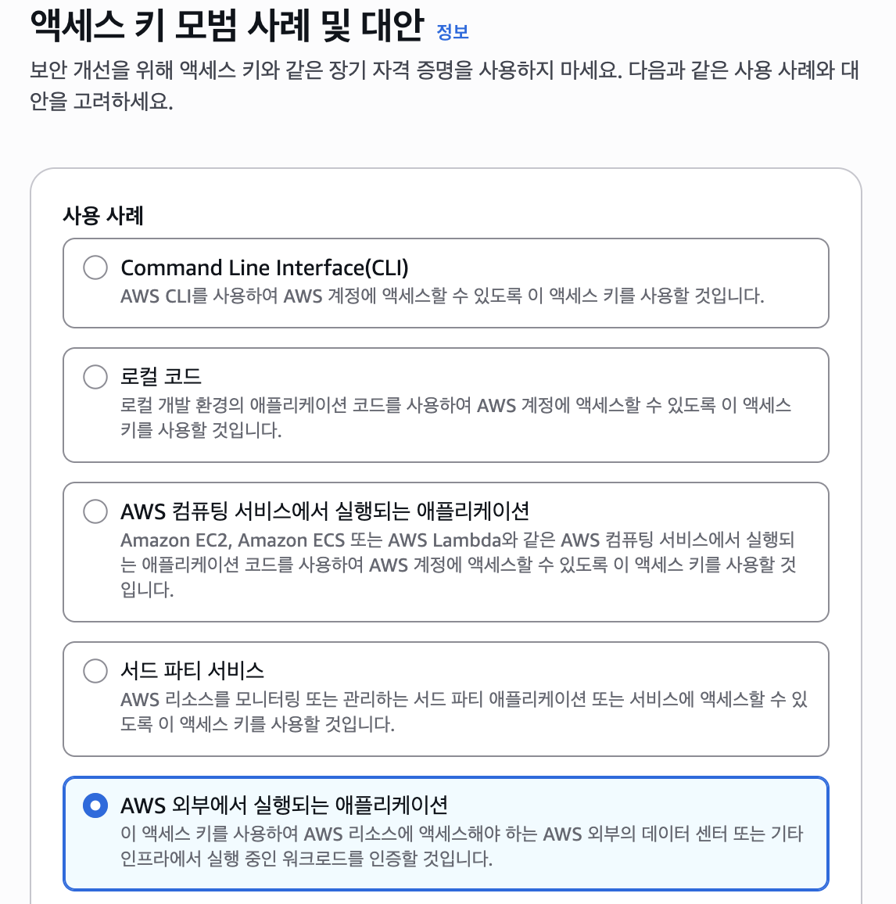
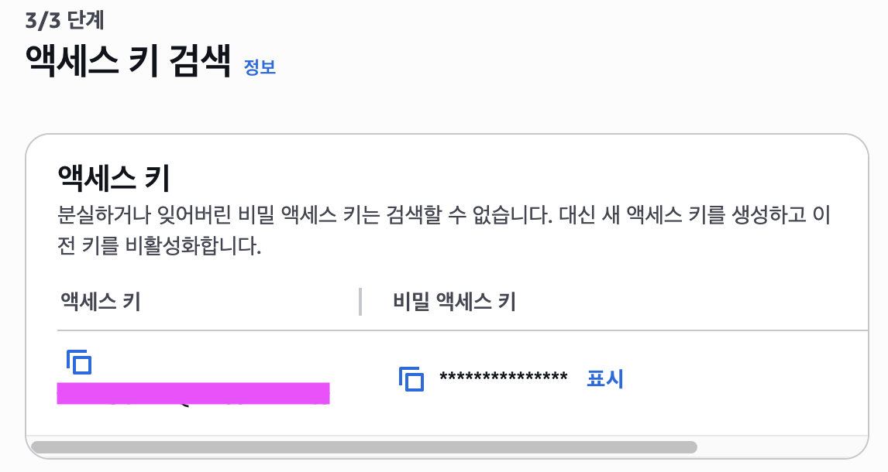

<br>

### GitHub Secrets 등록

#### `AWS_ACCESS_KEY_ID`, `AWS_SECRET_ACCESS_KEY` 등록

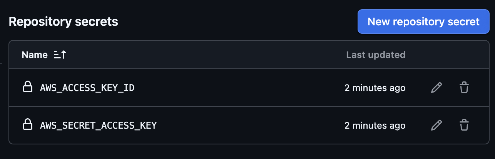

<br>

## 🔐 Access Key 사용 정리

### 🔑 배포/개발 환경에서 동일 Access Key를 사용하는 이유

#### 1. IAM 사용자 단위 발급

- Access Key는 IAM 사용자(User) 기준으로 발급된다.
- 같은 사용자에게 prod/dev 권한을 모두 부여하면 동일 키로 접근 가능하다.

#### 2.권한 정책 통합

- 하나의 사용자에 S3, CloudFront 권한을 동시에 주면 두 환경을 모두 관리할 수 있다.

#### 3. 관리 단순화

- dev/prod별로 키를 따로 발급하면 관리 포인트가 늘어난다.
- 실습 단계에서는 하나의 키만 써도 충분히 편리하다.

💡 실습에서는 편의를 위해 동일 Access Key를 사용했지만,  
실제 운영 환경에서는 dev/prod를 분리하는 것이 보안상 안전하다고 한다.

<br>

### ⚠️ 운영 환경에서의 권장 사항

- 보안 강화를 위해 환경별 IAM 사용자 분리가 권장된다.
- dev/prod를 분리하면 키 유출 시 피해 범위를 줄일 수 있다.
- 원칙: 최소 권한 부여(Principle of Least Privilege)

💡 실습에서는 편의상 동일 Access Key를 사용했지만,
운영 환경에서는 dev/prod를 분리하는 것이 보안상 안전하다.

<br>

## 9️⃣ 배포 과정 확인

```bash
# dev 작업 완료 후
$ git checkout main
$ git merge dev
$ git push
```

- dev 브랜치 → 개발용 배포
- main 브랜치 → 운영용 배포

<br>

### GitHub Actions 실행 결과

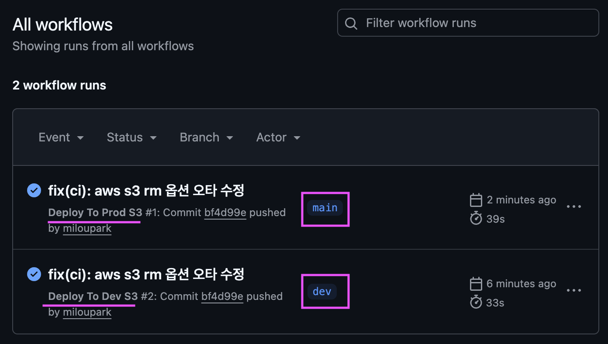

<br>

> 💡 이제 단순히 코드를 push만 해도 `S3 + CloudFront + ACM`까지 자동으로 배포된다.  
> 프로젝트 초반부터 환경을 분리해두면, 실서비스 안정성과 개발 편의성을 동시에 챙길 수 있다.
